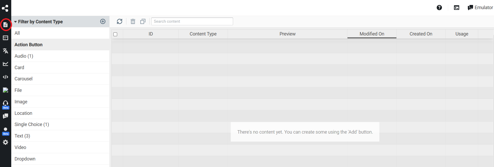
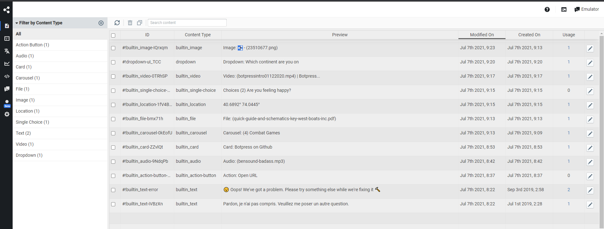

Botpress includes its own **Content Management System** (or **CMS**) to manage a chatbot's content. Everything your chatbot says comes from the CMS. Before we start discussing how you can create and edit the content of your chatbot, we should understand the different concepts of the CMS in Botpress.

## Content Type

A **Content Types** defines the structure of what the chatbot sends. It also dictates how your chatbot should render the content. It can be as straightforward or as complex as you want. For instance, a Content-Type could be a simple text or an image, or a carousel. 

> **🌟 Tip**: As a general rule, the more domain-specific the Content Types are, the easier it is to manage the chatbot for non-technical people.

Content Types are particular to the chatbots with which they are associated. Here are some typical examples:

- A restaurant "Menu" and "MenuPage" types
- A "QuestionWithChoices" type
- An "ImportantBroadcast" type

As you can see, Content Types on Botpress are much more specific than generalized "message types" on traditional chatbot building platforms.

Developers define content Types in JavaScript. Each Content Type has its own `.js` file, and Botpress automatically finds and registers new Content Types based on the directory and naming convention of the file.

## Content Element

A **Content Element** contains the data of a Content-Type. Multiple Elements can belong to a single Content-Type. For instance, the "text" Content-Type will include an Element for every sentence of your Bot, e.g., "Hello!", "What is your name?" etc.

Here's a Content Element example:

```json
{
  "id": "builtin_text-pSsHWg",
  "formData": {
    "text": "👋, {{state.$r}}!",
    "variations": ["Hello, {{state.$r}}!", "Welcome to Botpress, {{state.$r}}!"],
    "typing": true
  },
  "createdBy": "admin",
  "createdOn": "2018-05-14T00:57:36.026Z"
}
```

All Content Elements of the same Content Type are stored within a single `.json` file under the `data/bots/{your-bot}/content-elements/` directory.

> **Tip**: Remember that a Content Type tells **how** content gets rendered and a Content Element tells **what** to render.

## Adding Content
You can add and edit content in two ways:

### Flow Editor
You can add content while creating a node in the flow editor. Click the plus button, choose _say something_ click the file icon, choose a content type, then select _Add New_


### Content Interface
In Botpress Studio Interface, you can add content to your chatbot. Navigate to the _Content_ tab and click the plus sign next to "Filter by Content-Type". You can also add a specific content type by clicking the _plus_ button, which appears when you hover over the content title

The content interface is useful for the separation of concerns. You may want a non-technical collaborator to look through the content, editing it for grammar, and creating the desired tone for your chatbot.

## Channel Specific Rendering

All Content Types define a `renderElement` function that tells how a Content Element gets rendered on different channels.

> **Note:** This is critical because every channel is different and has a different set of functionalities. You want to customize and leverage the features of the other platforms to offer the best user experience possible.

### Example

Here's the web rendering function of the Text Content Type:

```javascript
function renderForWeb(data) {
  const events = []

  if (data.typing) {
    events.push({
      type: 'typing',
      value: data.typing
    })
  }

  return [
    ...events,
    {
      type: 'text',
      markdown: true,
      text: data.text
    }
  ]
}
```

Now, if we'd like to render for the messenger channel, we would add a specific rendering function for messenger and call it when `channel === 'messenger'`

```javascript
function renderForMessenger(data) {
  const events = []

  return [
    ...events,
    {
      type: 'message',
      user: data.profile,
      text: data.text,
      raw: data
    }
  ]
}

function renderElement(data, channel) {
  if (channel === 'web') {
    return renderForWeb(data)
  } else if (channel === 'messenger') {
    return renderForMessenger(data) // We add our rendering function
  }

  return []
}
```

## Translation

Your chatbots can support multiple languages. If a specific translation is not available for the current language, the chatbot will use the default language. When a user chats with your chatbot, we extract the browser's language and save it as a user attribute (available on the event as `user.language`).

Once the `user.language` property is set, it won't be overwritten. Therefore, you can ask the user what his preferred language is or use the NLU engine to detect it.

When rendering content elements, we will try to render the user's configured language; otherwise, it will use the chatbot's default one.

## Supported Content Types

### Action Button
This button triggers an action, often used in cards. You can add two parameters to this button, namely:
- Title: Text written on the button.
- Action: One of _say something, open url_ and _create postback_.

### Audio
Allows you to upload an mp3 audio file. The file will be playable within the chat.

### Card
A card is a message with a title and an optional subtitle. It also contains an image and action buttons. Note that you first need to create the action button separately.
### Carousel
A carousel is an array of cards. This collection of cards can either be presented as a horizontally scrolling slide or a vertical message stack, depending on the channel.
### File
The file content type is currently only supported by channel-vonage. It allows you to upload a pdf file which the user can download from the chat. In addition, you can add an optional title which will appear as a message under the file.
### Image
To show an image with an optional title in the chat window, you can use the _Image_ content element. Supported image formats are .tiff, .jpg, .png, .jpeg, .gif, .bmp, .tif
### Location
The location content type is currently only supported by channel-vonage. It generates a message showing a location with an optional address and title. Required parameters to complete this content element are longitude and latitude.
### Single Choice
This component carries a message, usually a question, and suggests choices to the user to fulfill the message. The user can only pick one option, and on selecting the preference, you can instruct your chatbot to get a custom value.
### Text
The text content type denotes a regular text message with optional typing indicators and alternates. You can use markdown in your text to add formatting and style, but please ensure that the target channel can render this text. 

You can write HTML in the text content on the web channel, and your chatbot will render it correctly. This opens up the possibility of including iFrames and constructing miniature web pages (commonly known as web views) in your content without creating custom components.
### Video
At the moment, the video content type is currently only supported by channel-vonage. It presents a message showing a video file with an optional title. You can either upload the video or link to a video file that will be fetched when the content element is invoked.
### Dropdown 
The dropdown displays a list of options to the user. It includes a message to the user, and you can customize the dropdown placeholder text and the text displayed on the selection button.

## Hands On Deck

Let's open our chatbot, Blitz, by clicking the name. We will be ushered to the Studio User Interface. The very first item in the left-hand menu is a link to the `Content` interface. In this interface, you can add, edit, and delete all the content types described above. I have added an example of each available content type. You can download the chatbot [here](https://dl.orangedox.com/content-blitz).


