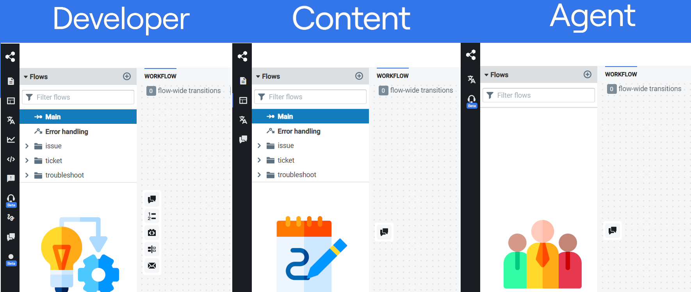
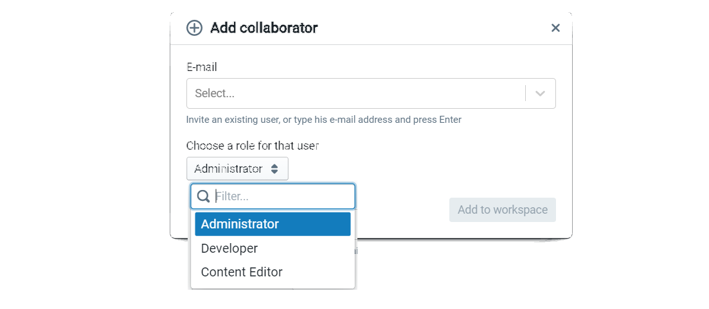
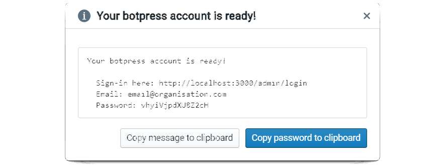

**RBAC** (Role-Based Access Control) allows you to control what collaborators can access.

By default, Botpress ships with three roles in addition to the administrator (developer, content editor, and agent), but you can change those and create new ones.




## Assigning a role to a collaborator

You can easily give a collaborator access to your chatbot and assign a role by navigating to the  **Collaborator** tab from the Administration dashboard, navigate to the "Collaborators" tab. Once there, click the **Add collaborator** and specify the collaborator and their email address.


After adding a role, Botpress will automatically generate a once-off password for the newly created user account. 


You can also change a collaborator's role by clicking the **Action** button next to the user whose role you wish to change. In addition to the changing roles, the menu allows you to change the password, remove a user from the workspace (Botpress retains the email and password, enabling you to add the user back), or delete the user. 


## Adding a new role

In the `<data>/global/workspaces.json` file, you'll find the `roles` property, which is an array of all the roles you can assign to the collaborators on your workspace. You can add, remove and edit roles by modifying this array directly.

### Rules

The rules which govern the users' rights are executed sequentially from first to last. For example, you can assign the following rules:

1. `+r-w` on `*`
2. `+w` on `bot.content`
3. `-r` on `bot.flows`

With the rules above, the user will _see_ everything but the flows and won't be able to _change_ anything but content.

### Operations (op)
Below are the access levels which Botpress can configure for a user.

| op  | description  |
| --- | ------------ |
| +r  | Grant read   |
| -r  | Revoke read  |
| +w  | Grant write  |
| -w  | Revoke write |

### Available Resources (res)
Below are the resources and interfaces to which you can give your chatbot studio users access.

| res               | description                                  |
| ----------------- | -------------------------------------------- |
| \_                | \_                                           |
| bot.\*            | All bots inside the workspace                |
| bot.logs          | The runtime logs                             |
| bot.notifications | Notifications                                |
| bot.skills        | The flow skills                              |
| bot.media         | File uploads (via the CMS)                   |
| bot.content       | The CMS elements (what the bot says)         |
| bot.flows         | The flow editor                              |
| bot.information   | Information about the bot                    |
| \_                | \_                                           |
| admin.\*          | The admin dashboard (/admin)                 |
| admin.users       | Admin collaborators                          |
| admin.roles       | Assigning roles ro collaborators             |
| admin.bots        | Creating bots and changing their information |
| \_                | \_                                           |
| module.\*         | Global access to all modules                 |
| module.MODULE_ID  |                                              |

Modules only support a single top-level resource **and one operation (write)**. Define as `module.MODULE_ID`, for example, `module.hitl` or `module.code-editor`.

### Example

```json
{
  "id": "hitl",
  "name": "Human in the Loop",
  "description": "Can view and respond to users by using the HITL module",
  "rules": [
    {
      "res": "*",
      "op": "+r"
    },
    {
      "res": "module.hitl",
      "op": "+r+w"
    }
  ]
}
```
