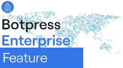
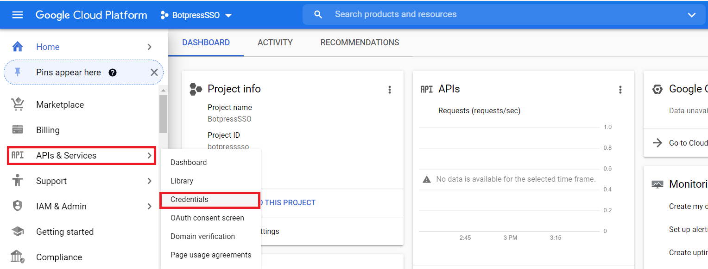
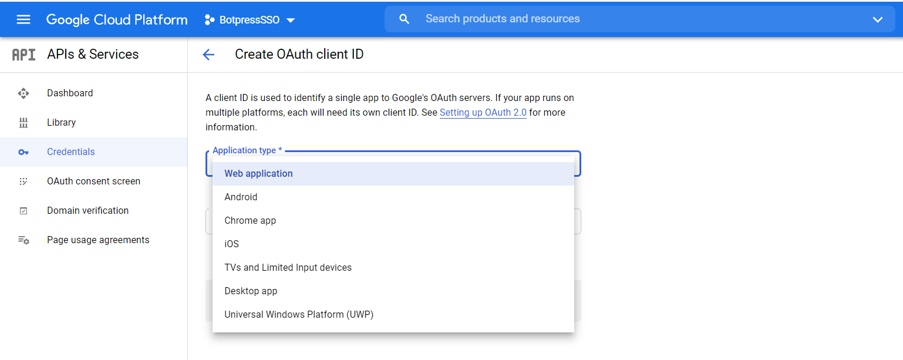
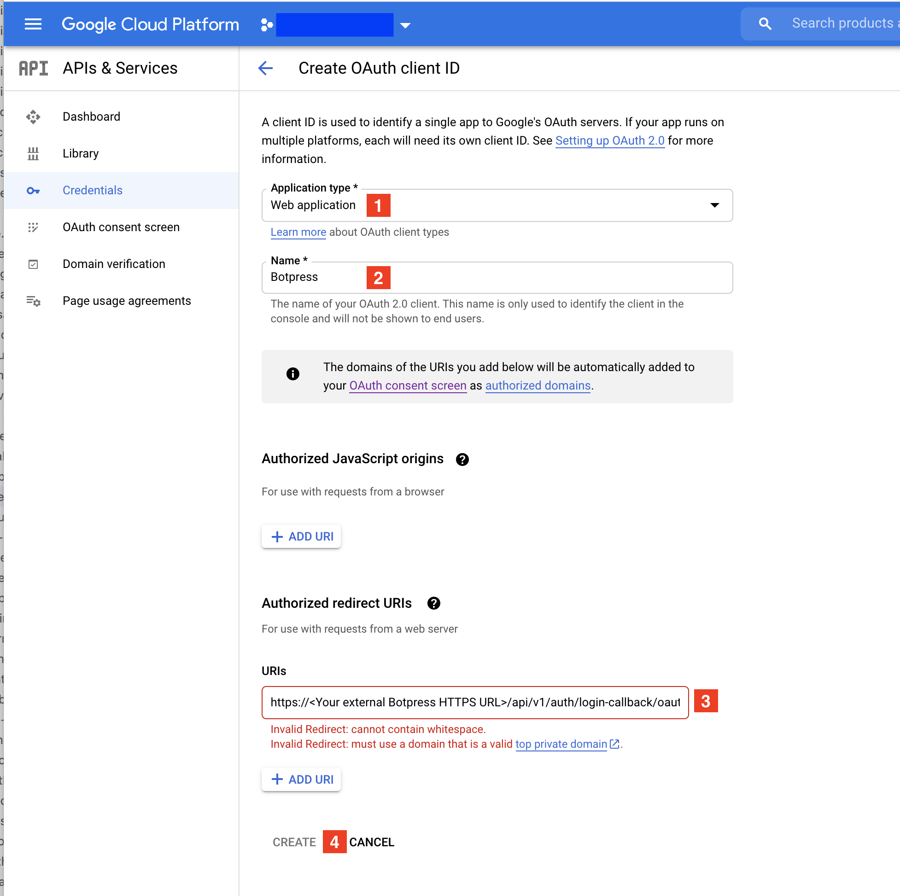
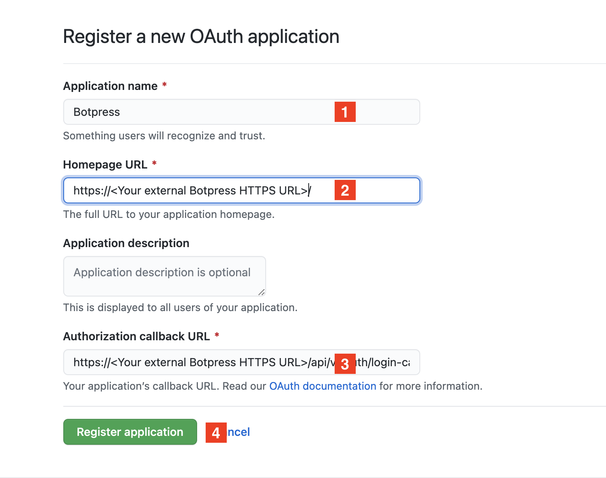
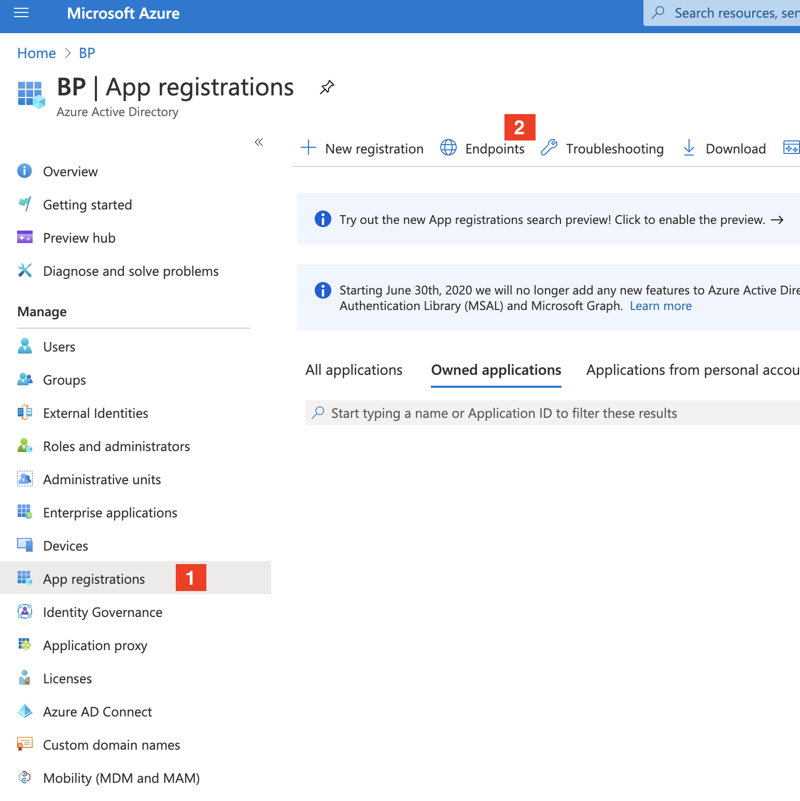
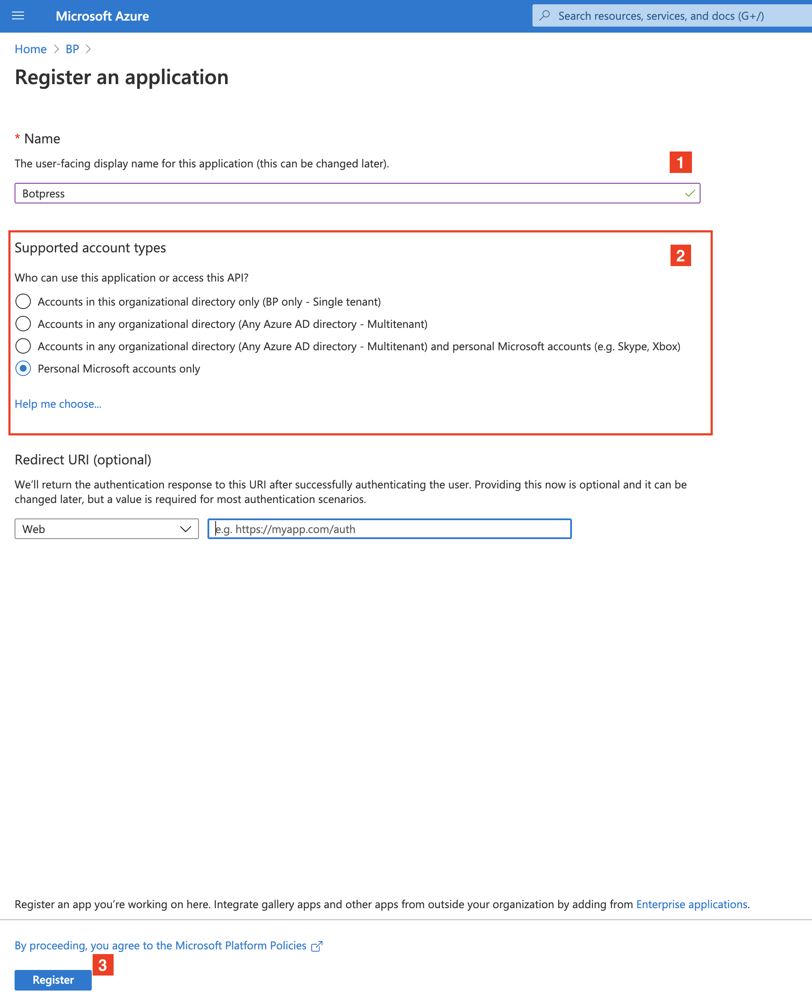
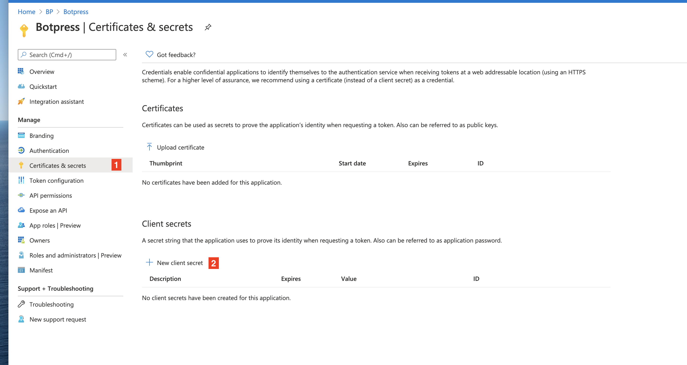
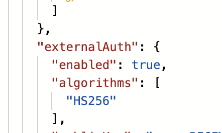
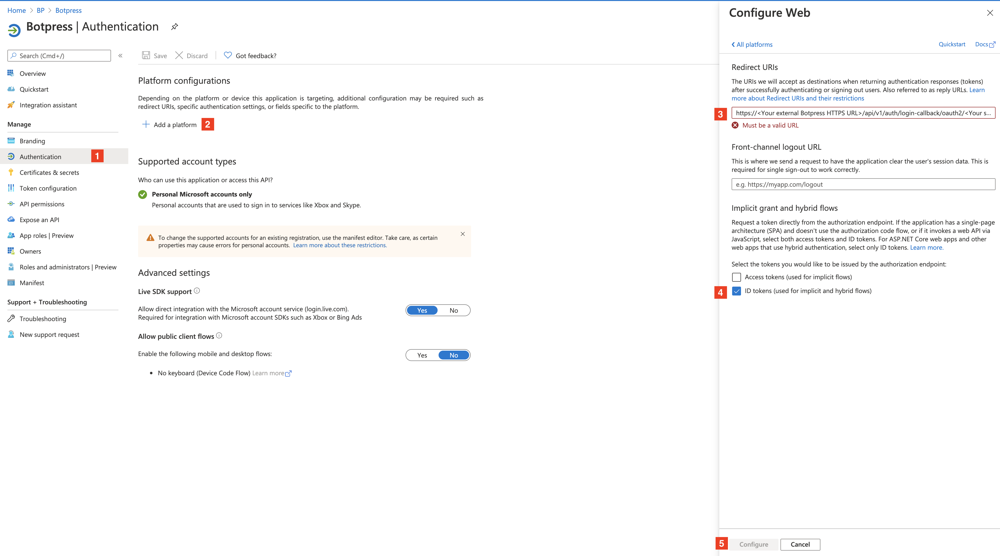

## SSO with Google OAuth2

### Step 1: Create OAuth2 credentials

Go to your [Google Cloud dashboard](https://console.cloud.google.com/), create a project if you have not already done so, and navigate to "APIs & Services" from the sidebar. 



Once there, go to the "Credentials" section and click "Create Credentials". Choose the "OAuth client ID" option.


You will be asked to create a consent screen. Here you choose how you want to configure and register your app, including your target users. You can only associate one app with your project.

### Step 2: Configure OAuth2 on Google Cloud

Once on the client configuration page, choose "Web application" for the "Application type", give the application any name you want and under "Authorized redirect URIs" and the following entry:

`https://<Your external Botpress HTTPS URL>/api/v1/auth/login-callback/oauth2/<Your strategy name>`


You may choose any url safe name as your strategy name.



A popup with your client ID and client secret will show up. Keep them for the next step.

### Step 3: Configure Botpress

Navigate to the Botpress code editor by going into any of your bots and add a new entry within `authStrategies` in the _botpress.config.json_ file, you may name the strategy whatever you want (keep the name URL safe) and fill in the entry in the following way:

```json
"<your strategy name>": {
  "type": "oauth2",
  "allowSelfSignup": false,
  "options": {
    "authorizationURL": "https://accounts.google.com/o/oauth2/v2/auth",
    "tokenURL": "https://www.googleapis.com/oauth2/v4/token",
    "clientSecret": "<client secret from Google Cloud>",
    "clientID": "<client ID from Google Cloud>",
    "callbackURL": "https://<Your external Botpress HTTPS URL>/api/v1/auth/login-callback/oauth2/<Your strategy name>",
    "userInfoURL": "https://openidconnect.googleapis.com/v1/userinfo",
    "scope": "openid profile email"
  },
  "fieldMapping": {
    "email": "email"
  }
}
```

### Step 4: Enable the strategy in Botpress

Under the `pro` settings in the _botpress.config.json_ file (should be around line 143), add your strategy name to the `collaboratorsAuthStrategies` array.

```json
"pro": {
	"collaboratorsAuthStrategies": [
	"default",
	"<Your strategy name>"
	],
```

Also make sure that the `externalAuth` object has `enabled` set to `true`:

```json
"externalAuth": {
	"enabled": true,
	"algorithms": [
	"HS256"
	],
```
### Step 5: Restart the Botpress server

A red cogwheel should appear in the bottom right of the Botpress UI. Click it to restart the server.

## SSO with GitHub OAuth2

### Step 1: Create OAuth2 App

Go on GitHub's [OAuth application registration page](https://github.com/settings/applications/new), choose an application name, set the Homepage URL to either your organization's website or your Botpress instance's external URL. For the "Authorization callback URL", set the following value:

`https://<Your external Botpress HTTPS URL>/api/v1/auth/login-callback/oauth2/<Your strategy name>`

You may choose any url safe name as your strategy name.



### Step 2: Create credentials

Once on your created application's configuration page, copy the "Client ID", click on "generate a new client secret," and copy the generated value as well for the next step.

### Step 3: Configure Botpress
Navigate to the code editor by going into any of your bots and add a new entry within `authStrategies` in the _botpress.config.json_ file, you may name the strategy whatever you want (keep the name URL safe) and fill in the entry in the following way:

```json
"<your strategy name>": {
  "type": "oauth2",
  "allowSelfSignup": false,
  "options": {
    "authorizationURL": "https://github.com/login/oauth/authorize",
    "tokenURL": "https://github.com/login/oauth/access_token",
    "clientSecret": "<Generated secret from GitHub>",
    "clientID": "<Client ID from GitHub>",
    "callbackURL": "https://<Your external Botpress HTTPS URL>/api/v1/auth/login-callback/oauth2/<Your strategy name>",
    "userInfoURL": "https://api.github.com/user",
    "scope": "user:email"
  },
  "fieldMapping": {
    "email": "email"
  }
}
```


### Step 4: Enable the strategy in Botpress

Under the `pro` settings in the _botpress.config.json_ file (should be around line 143), add your strategy name to the `collaboratorsAuthStrategies` array.

```json
"pro": {
	"collaboratorsAuthStrategies": [
	"default",
	"<Your strategy name>"
	],
```

Also make sure that the `externalAuth` object has `enabled` set to `true`:

```json
"externalAuth": {
	"enabled": true,
	"algorithms": [
	"HS256"
	],
```
### Step 5: Restart the Botpress server

A red cogwheel should appear in the bottom right of the Botpress UI; click it to restart the server.

## Azure OAuth2
**Note**: Azure OAuth2 only works for version 12.17.2 and later

### Step 1: Create a tenant
Navigate to Azure Active Directory Page in your Azure Portal and create a new tenant

### Step 2: Register an application
On the page of your newly created tenant, navigate to "App registrations".



Create a new application and choose the appropriate configuration for your use case in "Supported account types". Single and multi-tenant options are supported; keep the "Redirect URI" blank for now.



### Step 3: Configure Botpress
In your Botpress instance, navigate to the code editor and add a new entry within `authStrategies` in the _botpress.config.json_ file. you may name the strategy whatever you want (keep the name URL safe) and fill in the entry in the following way:

```json
"<your strategy name>": {
  "type": "oauth2",
  "allowSelfSignup": false,
  "options": {
    "authorizationURL": "<OAuth 2.0 authorization endpoint (v2)>",
    "tokenURL": "<OAuth 2.0 token endpoint (v2)>",
    "clientSecret": "<See step 4>",
    "clientID": "<Application (client) ID>",
    "callbackURL": "https://<Your external Botpress HTTPS URL>/api/v1/auth/login-callback/oauth2/<Your strategy name>",
    "scope": "openid profile email",
    "userInfoURL": "https://graph.microsoft.com/oidc/userinfo"
  },
  "fieldMapping": {
    "email": "email"
  }
}
```

### Step 4: Create a client secret
Next, navigate to "Certificates & secrets" and create a new client secret, copy its value and paste in the `clientSecret` field of your created strategy in the _botpress.config.json_ file



### Step 5: Enable the strategy in Botpress
Under the `pro` settings in the _botpress.config.json_ file (should be around line 143), add your strategy name to the `collaboratorsAuthStrategies` array.


> Please make sure that the `externalAuth` object has `enabled` set to `true`:



### Step 6: Configure callback URL in Azure
In your application in the Azure Active Directory portal, navigate to the "Authentication" page and add a platform. **Select "Web" for the platform type** and set your callback url with the one you configured in the _botpress.config.json_ file. **For the token type, select "ID tokens".**



### Step 7: Restart the Botpress server
A green cogwheel should appear in the bottom right of the Botpress UI; click it to restart the server.
